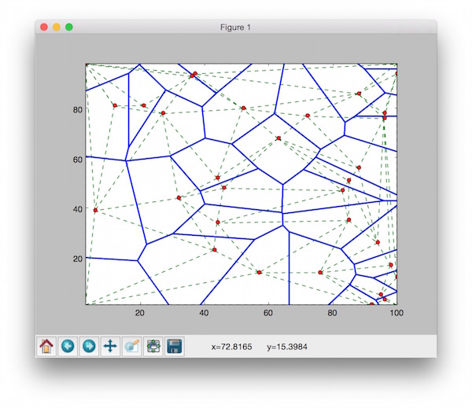

# PyDelaunay

The set of all points closest to a given point in a point set than to
all other points in the set is an interesting spatial structure called
a *Voronoi Polygon* for the point. The union of all the Voronoi polygons
for a point set is called *Voronoi Tessellation*.


Many applications have been found based on the neighbourhood information
provided by this tessellation.
The dual of Voronoi tessellation is
*Delaunay Tessellation*, also referred to as Delaunay Triangulation or
Triangulated Irregular Network (TIN),
which are lines drawn between points where their Voronoi polygons have an
edge in common.

Delaunay tessellation is the most fundamental neighbourhood structure
because many other important neighbourhood structures, such as,
*Gabriel Graph*, *Relative Neighbourhood Graph*
and *Minimal Spanning Tree*,
can be derived from it.

PyDelaunay is a Python implementation of an incremental algorithm for the construction of Delaunay Tessellation, based on the work of [Guibas & Stolfi 85].
The main algorithm is implemented in `TinAlgo.py`. We has supplied a convenience `TinBuild.py` to run the algorithm easily via the commandline input.

You can get help from `TinBuild.py` by using the `--help` parameter.

```
TinBuild - compute Voronoi diagram or Delaunay triangulation

TinBuild [-t -v -p -d]  [filename]

TinBuild reads from filename (or standard input if no filename given) for a set
of points in the plane and writes either the Voronoi diagram or the Delaunay
triangulation to the standard output.  Each input line should consist of two
real numbers, separated by white space.

If option -t is present, the Delaunay triangulation is produced.
Each output line is a triple i j k, which are the indices of the three points
in a Delaunay triangle. Points are numbered starting at 0.

If option -v is present, the Voronoi diagram is produced.

Other options include:

d    Output textually
p    Plot graphically
```

You can execute the `TinBuild.py` by plotting both Voronoi and Delaunay tessellation interactively.

```
python TinBuild.py -v -t -p test.pts
```



Another test program `TinAlgoTest.py` can be used for experiment.
It randomly generates 100 points to construct both Voronoi and Delaunay tessellation. Then, it plots the output to interactive mathplotlib window.

* Note: The `TinAlgo.py` only requires the standard Python library. However, if you want to use the plot function provided by `TinAlgoTest.py` or `TinBuild.py`, you need to install NumPy and mathplotlib.

## References
* [Guibas & Stolfi 85] Leonidas Guibas and Jorge Stolfi, *Primitives for the Manipulation of General Subdivisions and the Computation of Voronoi Diagrams*, ACM Trans. on Graphics, Vol 4. no.2, April 1985, pp 75-123.
